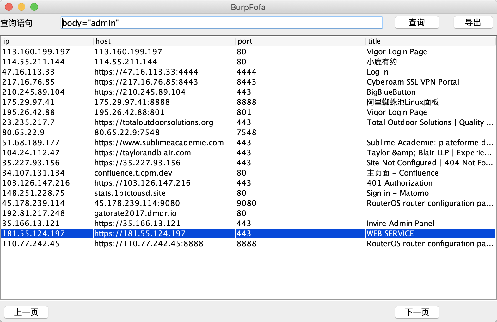

# burp-fofa

基于BurpSuite的一款FOFA Pro 插件。

## 版本说明

下载时优先安装`RELEASE`版本，如没有`RELEASE`，请考虑下载`Beat`版本。

版本号：1.0.5.Beta，1.0.0.RELEASE。

第一个数字：主版本，有可能进行大的架构调整，各大版本之间并不一定兼容。

第二个数字：次版本，在主版本架构不变的前提下，增加了一些新的特性或变化。

第三个数字：增量版本，bug修复，细节的完善。

RELEASE：发布版本，稳定版本，在项目中真正可用的版本。

Beta: 测试版本，发行时会首先发布Beat版本，如果测试稳定切换为`RELEASE`版本。
